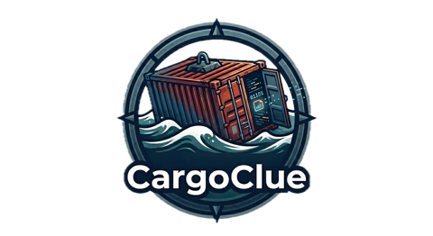

<p align="center">
  
</p>

<h1 align="center">CargoClue</h1>

<p align="center">
  A simple web app to browse, filter and pin logs from Docker containers and stacks.
</p>

---

CargoClue runs as a single container that talks to the host Docker socket, so one
instance can monitor **all** stacks (Compose projects) on the machine.

## Features

- **Stack selector** — a dropdown to switch between Compose projects, or *All stacks*.
- **Grouped container list** (left) — containers are grouped under their stack with a
  `running/total` count.
  - Click a **stack header** to follow the **aggregated logs of every container** in that
    stack at once; each line is tagged with its source container (colour-coded).
  - Click a **single container** to follow just that one.
  - Collapse/expand each stack with the caret; standalone (non-Compose) containers are
    listed under *Standalone*.
  - The list auto-refreshes every 10 s so state changes (start/stop) show up.
- **Live log window** (right) — logs stream in real time over a WebSocket and are
  **colour-coded by level**: errors red, warnings yellow, info blue, debug/plain dimmed.
- **Level filter chips** — toggle **Error / Warning / Info / Debug** to show only those
  levels (combine multiple; none selected = show everything).
- **Text filter & autoscroll** — free-text filter over the visible lines, with an
  autoscroll toggle that sticks to the bottom only when you're already there.
- **Pin entries** — hover a log line and click the 📌 to pin it.
- **Pinned list** (bottom, full width) — pinned entries persist per browser via
  `localStorage` and survive reloads; unpin individually or clear all.
- **Version indicator** — the running version (from `package.json`) is shown top-right,
  next to the live-connection status, so you can confirm which build you're looking at.

## Run

```bash
docker compose up -d --build
```

Then open **http://localhost:9999**

> **Note:** after changing files you must rebuild the image (`--build`).
> `docker compose --force-recreate` alone reuses the old image and keeps serving the
> previous version. Also hard-refresh the browser (Cmd/Ctrl + Shift + R) to bypass
> cached `app.js` / `style.css`.

The Compose file mounts `/var/run/docker.sock` **read-only** so CargoClue can list
containers and follow their logs. No other configuration is needed.

## Run locally (without Docker)

Requires Node 20+ and access to a Docker socket on the host:

```bash
npm install
npm start
```

## Configuration

| Env var         | Default                | Description                       |
| --------------- | ---------------------- | --------------------------------- |
| `PORT`          | `9999`                 | HTTP port the app listens on.     |
| `DOCKER_SOCKET` | `/var/run/docker.sock` | Path to the Docker socket to use. |

## How it works

- `dockerode` talks to the Docker Engine API over the mounted socket.
- `GET /api/stacks` and `GET /api/containers?stack=…` drive the UI lists.
- `GET /api/version` exposes the version shown in the header.
- `WS /ws/logs?ids=<id1,id2,…>&tail=300` streams logs. A single id follows one
  container; a comma-separated list follows a whole stack, multiplexing all of them
  onto one socket. Non-TTY streams are demultiplexed into stdout/stderr and a log level
  is inferred per line for colour-coding.

## Versioning

The version in `package.json` is bumped on **every** change and surfaced in the UI
(top-right). Use it to confirm a rebuild actually took effect.

## Security note

The Docker socket is mounted read-only, but access to it is still powerful.
Run CargoClue only on trusted networks, or put it behind authentication / a
reverse proxy if exposing it beyond localhost.
